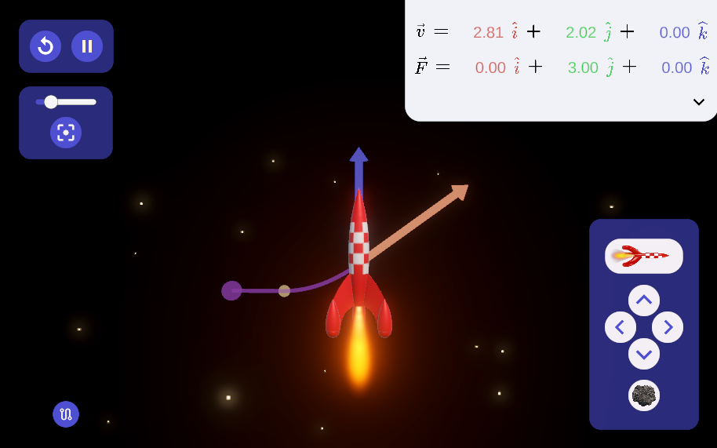

# Space Rocket App

## Description

This Unity application was developed as part of a Master's thesis within the Interaction Systems Group [(REACT)](https://www.epfl.ch/labs/react/) at EPFL.

The aim of this application is to offer digital support enabling teachers to build interactive and customizable course scenarios. 

The application covers the basics of Newton's laws. In concrete terms, a space rocket is simulated and users can play with the rocket's initial velocity and thrust force.

## Acknowledgment

Special thanks to [Austin Peel](https://github.com/austinpeel/) for his advice during development, and for enabling the reuse of some of his own Unity components.

## License

Distributed under the TBD...
